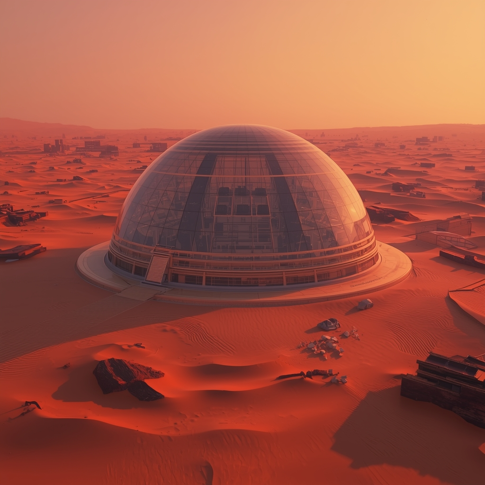

# 🚀 Missão Olympus: O Seu Próximo Destino é Marte

## 📒 Descrição
Um guia turístico imersivo que utiliza IAs generativas para prever como será a vida e o turismo na primeira colônia marciana em 2150. O projeto explora a criação de conteúdo fotorrealista e narrativas envolventes para simular uma experiência de viagem real.

## 🤖 Tecnologias Utilizadas
* **Gemini (Google):** Para roteirização, storytelling e estruturação do projeto.
* **Leonardo.ai:** Para geração da imagem fotorrealista da cidade de Olympus City.
* **ElevenLabs:** Para a criação da voz sintética do guia turístico com entonação natural.

## 🧐 Processo de Criação
O processo começou com a definição do tom de voz (futurista e sofisticado) no Gemini para criar o roteiro. Em seguida, utilizei prompts específicos no Leonardo.ai para gerar uma imagem que seguisse a estética "Cyberpunk/Space-Age". Por fim, o roteiro foi narrado pela IA da ElevenLabs, onde ajustei a estabilidade da voz para garantir o efeito "Natty" (natural).

## 🚀 Resultados
O resultado é um cartão postal digital multimodal que desafia a percepção entre o real e o gerado por IA:

****

🎤 **[Ouça aqui a narração do Guia Turístico](audio-guia.mp3)**

## 💭 Reflexão (Opcional)
O desafio de criar algo 'natty' com IA reside nos detalhes. É fácil gerar conteúdo, mas refiná-lo para que pareça autêntico exige uma curadoria humana precisa e o uso estratégico de prompts avançados.
